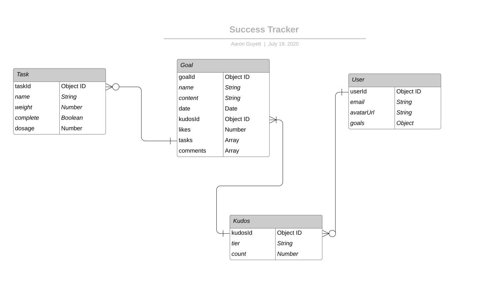

# Success Snake v0.25
[Success Snake](https://success-snake.herokuapp.com) is a social media app that utilizes the MERN stack and is hosted on Heroku.
## Features
Users can create an account to share their goals with others. A goal is broken down into tasks and users can give kudos to others when a task is completed or shared. The application helps track goals and utilizes an API to display motivational quotes while connecting others with like-minded people.
## Images
Coming soon!
## Getting Started
* Sign Up at [Success Snake](https://success-snake.herokuapp.com)
## Technologies Used
* React
* Express
* Node
* MongoDB
* CSS: Material UI
* HTML
* Javascript
* JSON Web Token (JWT)
* Node Packages: serve-favicon, morgan, mongoose, dotenv, bcrypt, react-router-dom, react-helmet
## APIs Integrated
* [They Said So](https://quotes.rest) - Quotes API
* Coming Soon!
## User Stories
* Users can create an account.
* Users can login or logout.
* Users can see a motivational quote.
* Users can view an account page.
* Users can be frustrated by features that look implemented but do not yet function (ex. search).
## Planning
* [Trello Board](https://trello.com/b/3Zyw3cIf/success-platform)
* [Wireframes](https://balsamiq.cloud/sah357c/pmggzzy)

## Future Goals
* Integrate other social media services - ex. Share to LinkedIn
* Job currency
* Direct messaging
* Mobile app integration with API
* Mentors and task sharing
* Integrate stats API
* Integrate graphing API